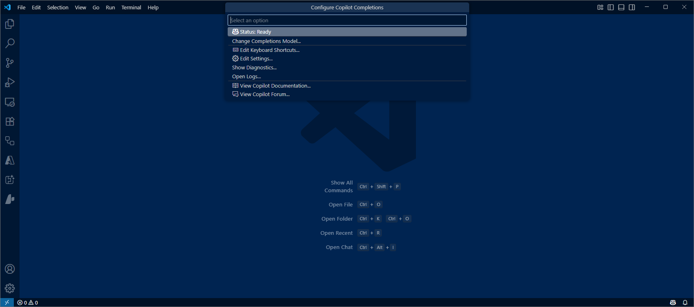

# Getting Started

## Start with nothing

- Create empty folder and open Visual Studio Code in that folder 

```
mkdir colorsapi
cd colorsapi
dir
code . 

```


## Check GitHub Copilot is enabled

- Check GitHub Copilot and GitHub Copilot Chat extensions are installed

- Hover over icon in bottom right handcorner to show GitHub Copilot is running


- If not signed in, then authenticate to GitHub ... you will need credentials with an account that has GitHub Copilot enabled


## Check GitHub Copilot Chat is enabled

- Select the Copilot Chat icon on the left ... notice the conversational GPT-like experience



- Ask it a question 


## Ready to code 

We are ready - lets get coding  

