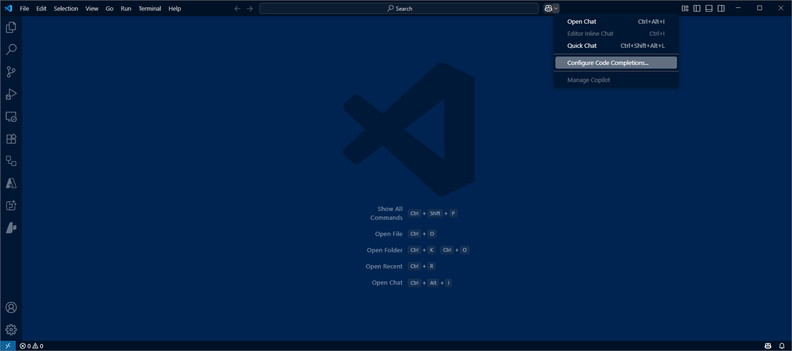
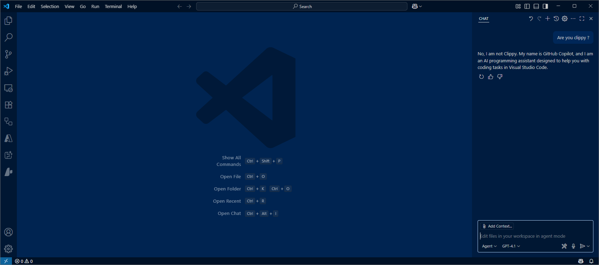

# Getting Started

Some pre-checks to make sure GitHub Copilot is enabled and ready for coding.

## Check GitHub Copilot is up to date 

- Make sure the following extensions are updated to latest versions: GitHub Copilot, GitHub Copilot Chat, C# Dev Kit 

## Check GitHub Copilot is licensed 

- Hover over the Copilot icon in bottom right corner - if ncecessary, then sign-in to GitHub 

- Once signed-in to GitHub, hover again over the Copilot icon to show the GitHub Copilot status

## Check GitHub Copilot Completions is enabled

- A Copilot icon is also to the right of the Command Pallete at the top - select the icon followed by menu option `Code Completions`

- The Status should show as 'Ready'.  There are options for configuration settings and disgnostics.

## Check GitHub Copilot Chat is enabled

- Again select the icon next to the Command Pallete followed by menu option `Open Chat`

- The Chat panel will appear ... ask it a question

## Ready to code

We are ready - lets get coding.
