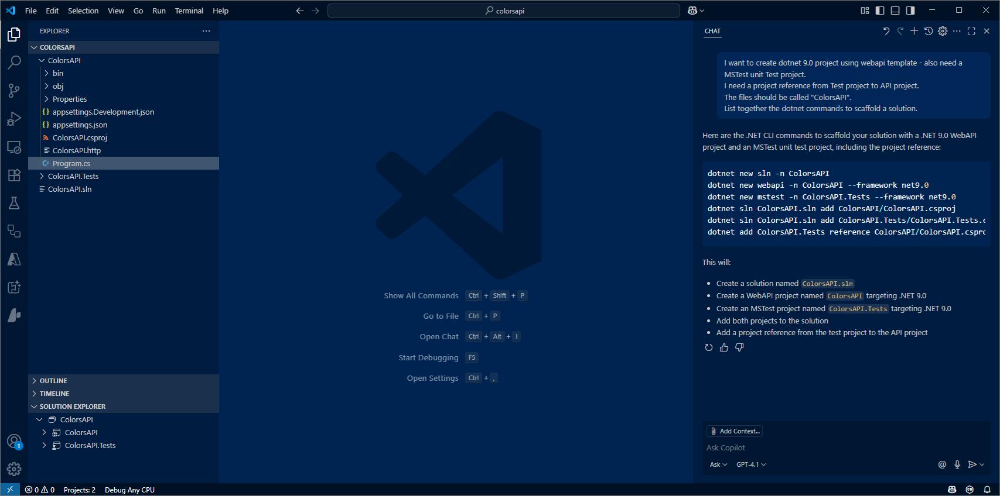

# Develop API WebApp 

The objective is to create an API WebApp for handling color objects.


## Scaffold the basic solution

Lets use GitHub Copilot Chat to help scaffold a basic API WebApp.  The better the prompt, the better suggestion returned by GitHub Copilot.

- From the previous section, we have already started VSCode and opened an empty folder

- Ask Copilot Chat the following

``` 
I want to create dotnet 8.0 project usinng webapi template  - also need a MSTest unit Test project.
I need a project reference from Test project to API project.
The files should be called "Colors".  
List together the dotnet commands to scaffold a solution. 
```


Response will be something like this :

```
# Create a new solution
dotnet new sln -n Colors

# Create a new Web API project
dotnet new webapi -n Colors.API

# Create a new MSTest project
dotnet new mstest -n Colors.Tests

# Add the projects to the solution
dotnet sln Colors.sln add Colors.API/Colors.API.csproj
dotnet sln Colors.sln add Colors.Tests/Colors.Tests.csproj

# Add a project reference from the test project to the API project
cd Colors.Tests
dotnet add reference ../Colors.API/Colors.API.csproj

```

- Within VSCode open up terminal.  Use the commands suggested by Copilot Chat.
  - Notice the files created. Two projects (API and Test).



- Open Solution file - use F1 `.NET Open Solution`


- Open `Program.cs` - remove existing Routes & Model (things to do with weather)


We now have our basic API skeleton code - we shall now add the logic for our Colors API


## Add Data model

We first define the schema for our ColorsItem object

- Create `ColorsItem.cs`  

- Ask Copilot Chat the following

```
Create colors model called ColorsItem to include a name and hexcode.
```

- Insert code into `ColorsItem.cs`


- Switch back to `Program.cs`  

- Ask Copilot Chat the following

```
Intialize a list of ColorsItem with  "red", "yellow", "black" 
```

- Insert code into `Program.cs`


## Add API routes 

- Ask Copilot Chat the following

```
using ColorsItem - create two API routes.
First - an API to return all colors.   
Second - an API to insert a new color.
im using .NET 8 minimal APIs
```


You can also prompt using an inline comment

```
//add a route to return a random color
```


- Hit `Tab` to accept the suggestion.  Or use `Alt [` and `Alt ]` to view alternatives


## Add Utility function 

Wwe shall now add some logic to validate the hexcode passed in the API call to add a new color.

- Create file `ColorUtilities.cs` and add code 

- Ask Copilot Chat the following

```
I want a new static class called ColorUtilities.
I want a ValidateHexCode function using Regex - add to static class  ColorUtilities.
```

- Insert code into `ColorUtilities.cs` 

 

- Irrespective of the code suggested, for lab purposes only check for 6 character hexcodes - we will fix this later 

```
  string pattern = @"^#([A-Fa-f0-9]{6})$";   // 6 character 
  string pattern = @"^#([A-Fa-f0-9]{6}|[A-Fa-f0-9]{3})$";   // 3 or 6 character 
```

- Try this inline comment 

```
// function to test for shade of red
```

- Switch back to  `Program.cs` 

- Add Hexcode validation to the Insert new Color route .  Might need encouragement / prompting to use our validation utility function.

```
// hexcode validation
```


## Run the API WebApp

Our API code is now complete

- Use F5 to run the application 


Use the Swagger UI to test the WebApi

- Get all Colors

- Add a new color - use valid hexcode

- Add a new color - use invalid hexcode ... check for error status code

- Get a random color 


