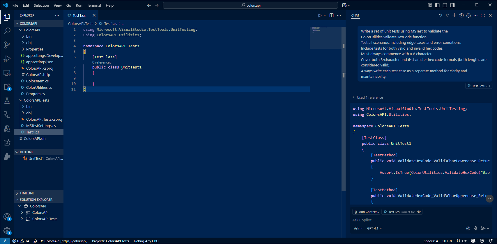
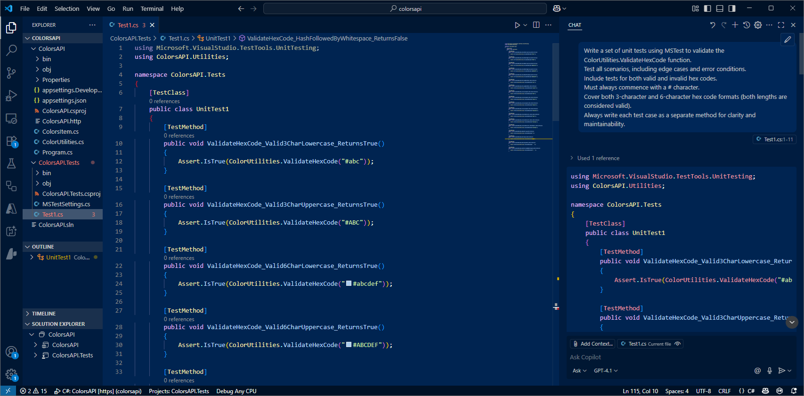
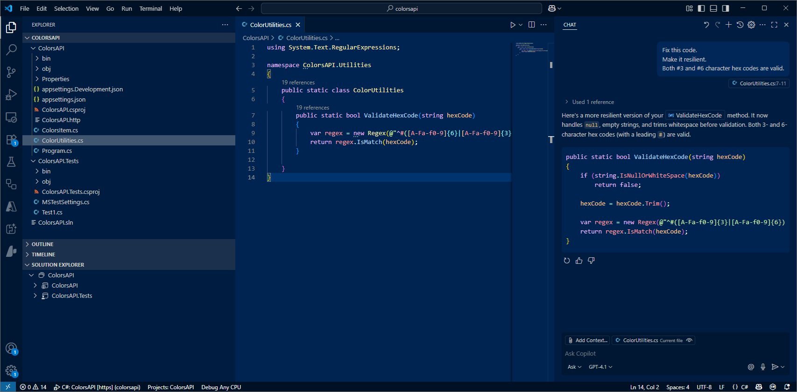

# Unit Tests

There is one part of development that can be quite tedious - creating unit tests.  In this section we shall use GitHub Copilot to help.

## Create unit test

- Switch to Test project and open `UnitTest1.cs`.

- Ask Copilot Chat the following:

```text
 Write a unit test using MSTEST to validate the ColorUtilities.ValidateHexCode function.  
 I need to test all scenerios / edge cases / errors.  
 Test for both 3 and 6 character hexcodes - test for valid and invalid values.  
 Separate the tests.
```

- Just copy in the `[TestMethods]`.



- Load the Test blade and hit refresh icon.



- Run Tests.


Depending on the code for hexcode validation - the Test for 3 digit Hexcodes may fail .  And our validate code never tested for a null value.

- Use Copilot to fix the validation routine.  Select the code and ask:

```text
Fix this code .  Make it resilient.
```


- Re-run unit tests ... make sure they now all pass.


