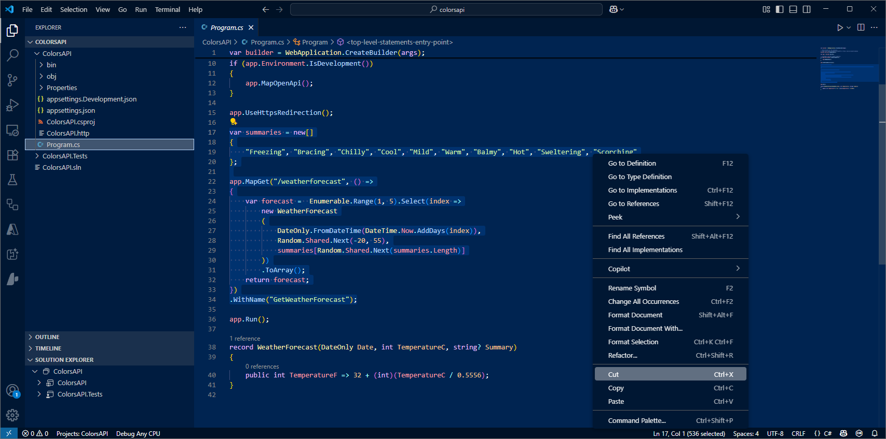
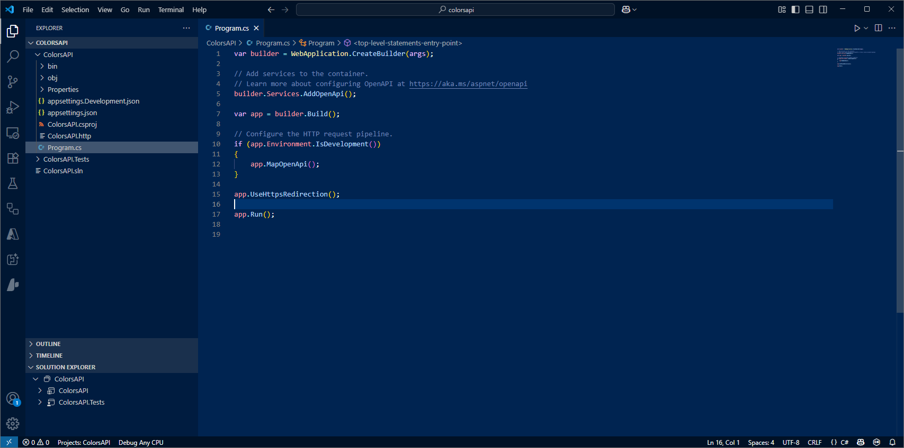
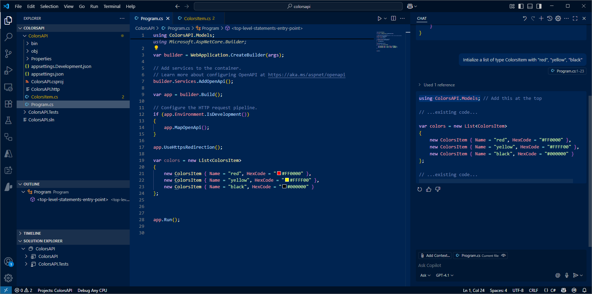
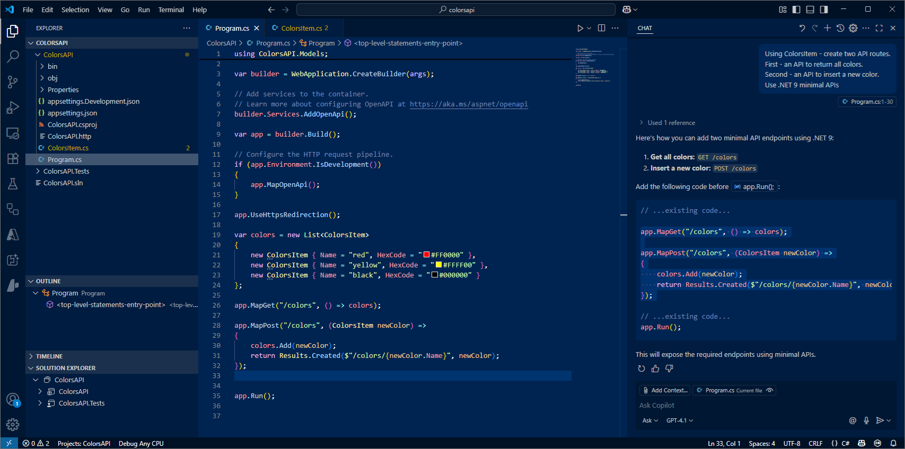
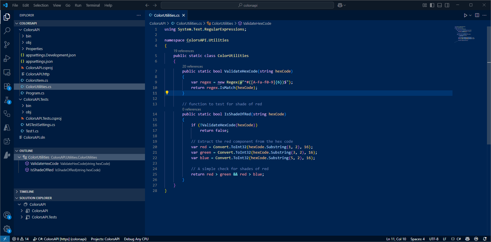
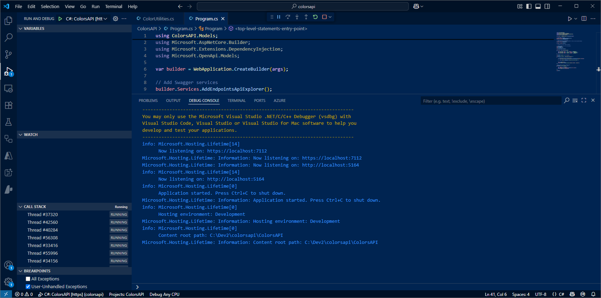
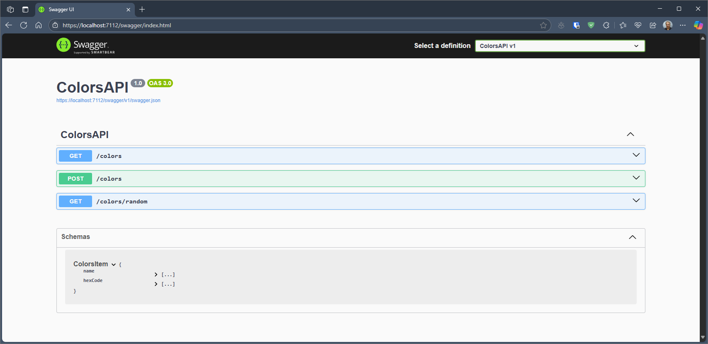

# Develop API WebApp

The objective is to create an API WebApp for handling color objects.

## Start with nothing

- Create empty folder and open Visual Studio Code in that folder.

```powershell
mkdir colorsapi
cd colorsapi
dir
code . 

```


## Scaffold the basic solution

Lets use GitHub Copilot Chat to help scaffold a basic API WebApp.  The better the prompt, the better suggestion returned by GitHub Copilot.

- From the previous section, we have already started VSCode and opened an empty folder.

- Ask Copilot Chat the following.

```text
I want to create dotnet 9.0 project using webapi template  - also need a MSTest unit Test project.
I need a project reference from Test project to API project.
The files should be called "ColorsAPI".  
List together the dotnet commands to scaffold a solution. 
```


Response will be something like this :

```text
dotnet new sln -n ColorsAPI
dotnet new webapi -n ColorsAPI --framework net9.0
dotnet new mstest -n ColorsAPI.Tests --framework net9.0
dotnet sln ColorsAPI.sln add ColorsAPI/ColorsAPI.csproj
dotnet sln ColorsAPI.sln add ColorsAPI.Tests/ColorsAPI.Tests.csproj
dotnet add ColorsAPI.Tests reference ColorsAPI/ColorsAPI.csproj
```

- There is an icon to copy the chat text returned from Copilot.  

- Within VSCode open up terminal.  Paste and run commands suggested by Copilot Chat.

- Notice the files created. Two projects (API and Test).


- Open Solution file - use F1 `.NET Open Solution`.


- Open `Program.cs` - remove existing Routes & Model (things to do with weather).



We now have our basic API skeleton code - we shall now add the logic for our Colors API.



## Add data model

We first define the schema for our ColorsItem object:

- Switch to Agent mode ... option at bottom of Chat panel

- Ask Copilot Chat the following:

```text
Create file 'ColorsItem.cs' .
Add to this file a colors model called ColorsItem to include a name and hexcode.
```

- Click the button to `Create file` and specify the location to be within the ColorsAPI project.  (sometimes you may need to create the file first)


- Switch back to `Program.cs`  

- Ask Copilot Chat the following:

```text
Intialize a list of type ColorsItem with  "red", "yellow", "black" 
```

- Insert the suggested code into `Program.cs`




## Add API routes

- Ask Copilot Chat the following:

```text
Using ColorsItem - create two API routes.
First - an API to return all colors.   
Second - an API to insert a new color.
Use .NET 9 minimal APIs
```



You can also prompt using an inline comment

```text
//add a route to return a random color
```

- Hit `Tab` to accept , `Esc` to decline.


- Hit `Tab` to accept the suggestion.  Or use `Alt [` and `Alt ]` to view alternatives.

## Add utility function

We shall now add some logic to validate the hexcode passed in the API call to add a new color.

- Create file `ColorUtilities.cs` and add code .

- Ask Copilot Chat the following.

```text
Create file `ColorUtilities.cs` and add code .
I want a new static class called ColorUtilities.
I want a ValidateHexCode function using Regex - add to static class ColorUtilities.
```

- Click the button to `Create file` and specify the location to be within the ColorsAPI project.  (sometimes you may need to create the file first)

- Irrespective of the code suggested, for lab purposes only check for 6 character hexcodes - we will fix this later during testing,

```text
  string pattern = @"^#([A-Fa-f0-9]{6})$";   // 6 character 
  string pattern = @"^#([A-Fa-f0-9]{6}|[A-Fa-f0-9]{3})$";   // 3 or 6 character 
```

- Also, if present - remove any check for a null being passed - again, we will fix this later during testing.

- Optional, try this inline comment:

```text
// function to test for shade of red
```



- Switch back to  `Program.cs`.

- Add Hexcode validation to the Insert new Color route .  Might need encouragement / prompting to use our validation utility function.

```text
// Validate the hex code before adding
```


## Add Swagger UI

Lets add the Swagger UI to our API application - this is a web interface that provides a visual interface for exploring and testing RESTful APIs.  

There are several steps involved, but GitHub Copilot Agent Mode will take care of them for us - making the whole process much simpler.

- Switch to Agent Mode using the button at the bottom of the Chat panel.

- Then, ask Copilot Chat the following:

```
Add Swagger UI
```

- Accept any requests 


- Check the code that has been added which implements the Swagger UI.


## Run the API WebApp

Our API code is now complete.

- Use F5 to run the application. The application should compile amd build successfully. Select C# . Select the ColorsAPI app to run.

- The console log will display the URL web address of the application 

- In a web browser access this URL but tack on /Swagger 





Use the Swagger UI to test the API application

- Get all Colors.

- Add a new color - use valid hexcode.

- Add a new color - use invalid hexcode ... check for error status code.

- Get a random color.


