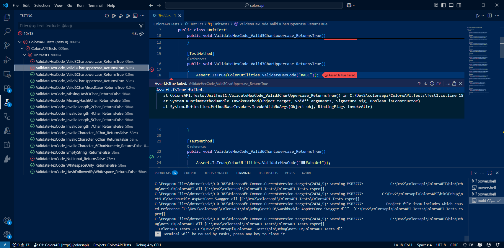

# Unit Tests

There is one part of development that can be quite tedious - creating unit tests.  In this section we shall use GitHub Copilot to help.

## Create unit test

- Switch to Test project and open `UnitTest1.cs`.

- Ask Copilot Chat the following:

```text
Write a set of unit tests using MSTest to validate the ColorUtilities.ValidateHexCode function.
Test all scenarios, including edge cases and error conditions.
Include tests for both valid and invalid hex codes.
Must always commence with a # character.
Cover both 3-character and 6-character hex code formats (both lengths are considered valid).
Always write each test case as a separate method for clarity and maintainability.
```

- Save the file generated.  Delete any redundant test files.


- Switch to Test Explorer and hit refresh to compile the tests


- Use Test Explorer panel in VS Code to run the tests

- Refresh to build the tests 

- Run the tests 

The tests fail when passing a 3 character hexcode.  The validation routine is saying its invalid which is wrong. 



The tests faile when passing a null.  An exception has occured as the program has not catered for this.


 

- Open the file `ColorUtilities.cs`

- Use Copilot to fix the validation routine.  Select the code and ask Chat:

```text
Fix this code.  
Make it resilient. 
Both #3 and #6 character hex codes are valid.
```


- Re-run unit tests ... make sure they now all pass.

