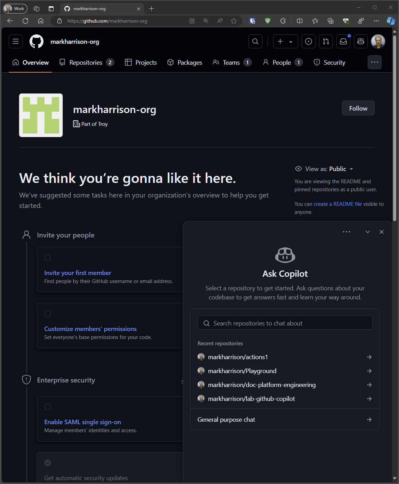
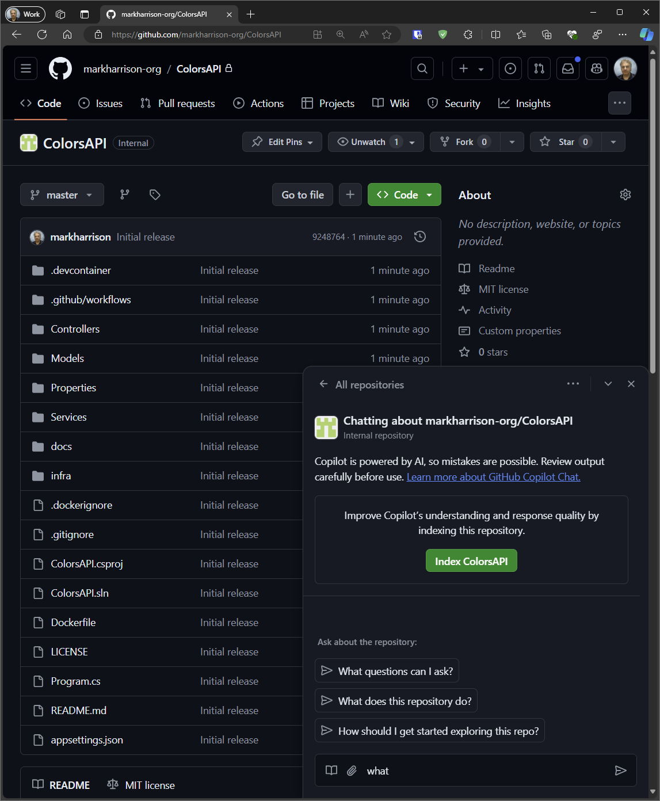
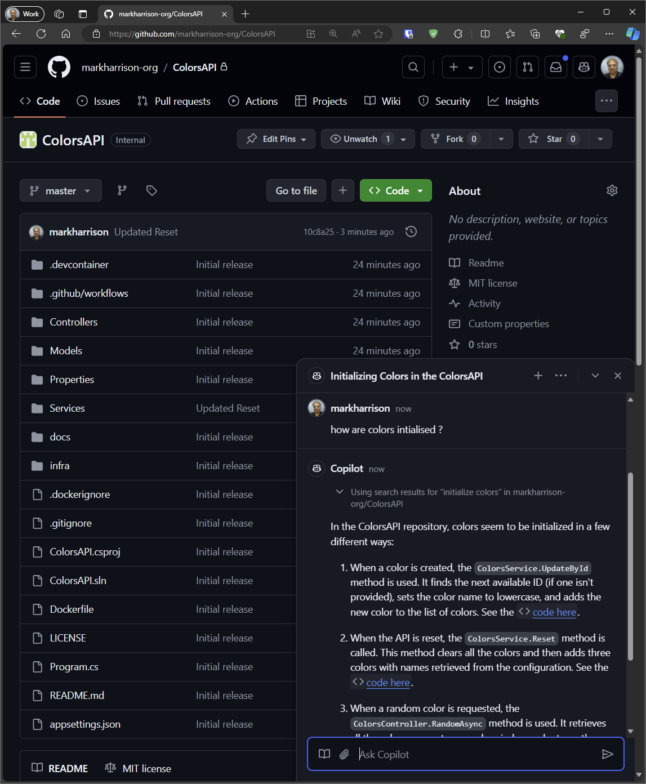
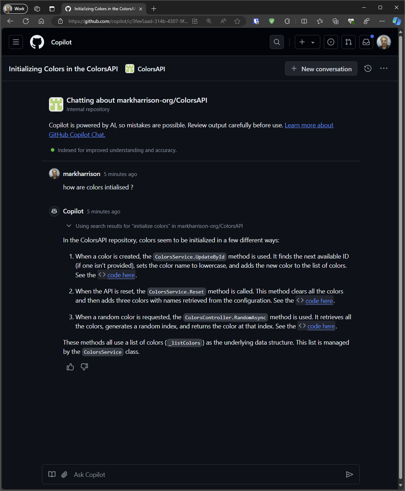
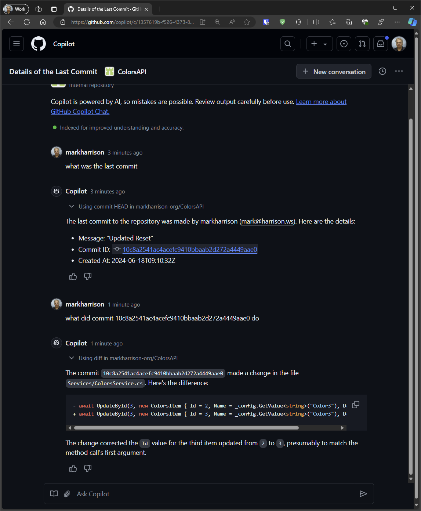

# Understand the codebase 

## General programming conversations

Within GitHub - we can use the Copilot Chat Assistant to ask general questions about "Code and programming" - or pose questions related to a specific GitHub repository . 

- Select the Copilot icon (top right)

- There is a link for `General purpose Chat`

Lets understand more about a specific repository

- Select a repository

## Index repository 

We can improve the response quality by indexing the repository.

- If not Indexed - then press the `Index` button.  This action displays a message  "Copilot is indexing this repository. This may take a few minutes."

## Ask questions about codebase

- Enter a question to learn more about the code stored in the repository

We can make the chat conversation full screen 

- select the three dots and the option `Take conversation to immersive` 

## Ask questions about activity 

We can include questions about issues, pull requests, commits and releases. 

