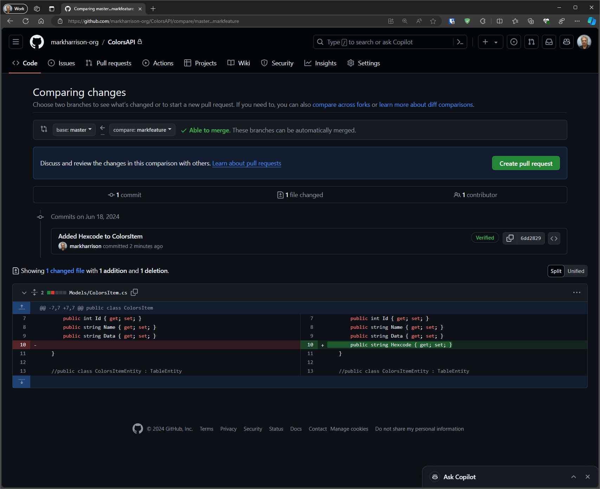
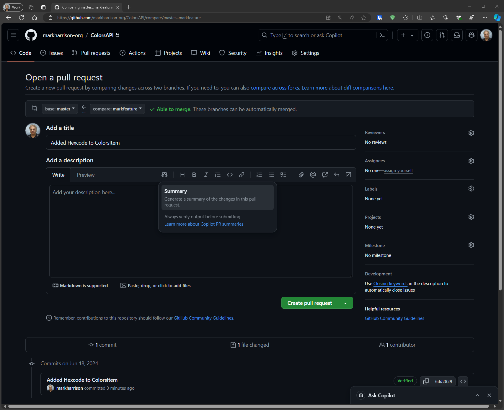
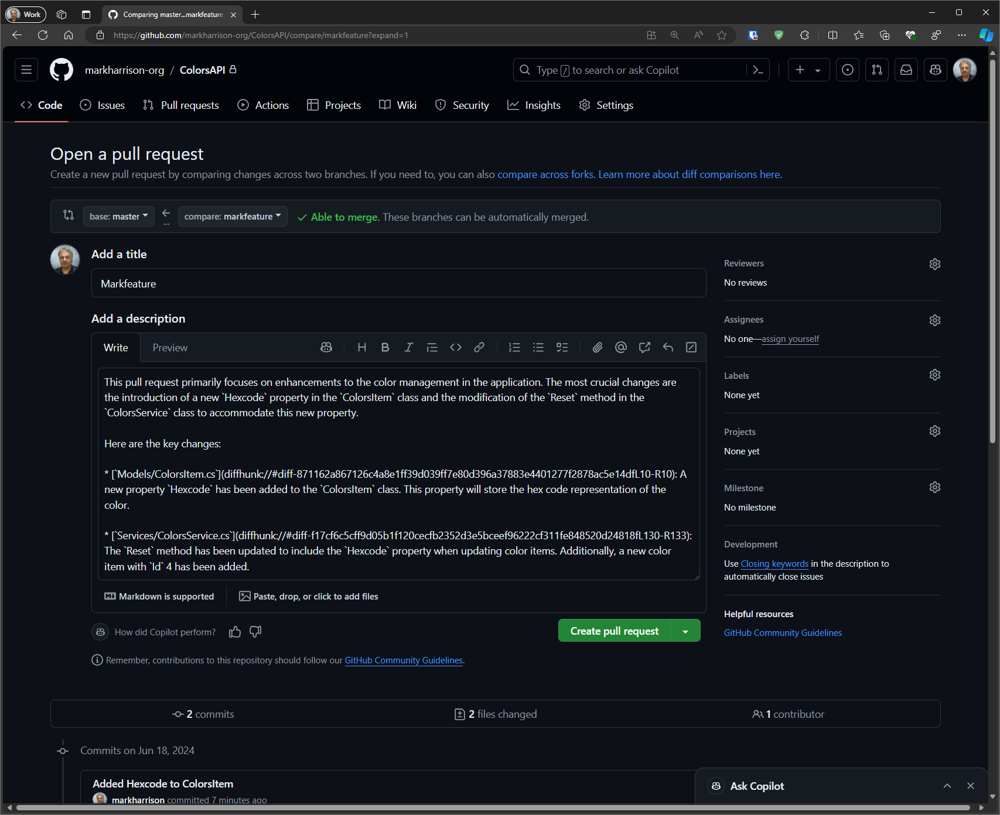
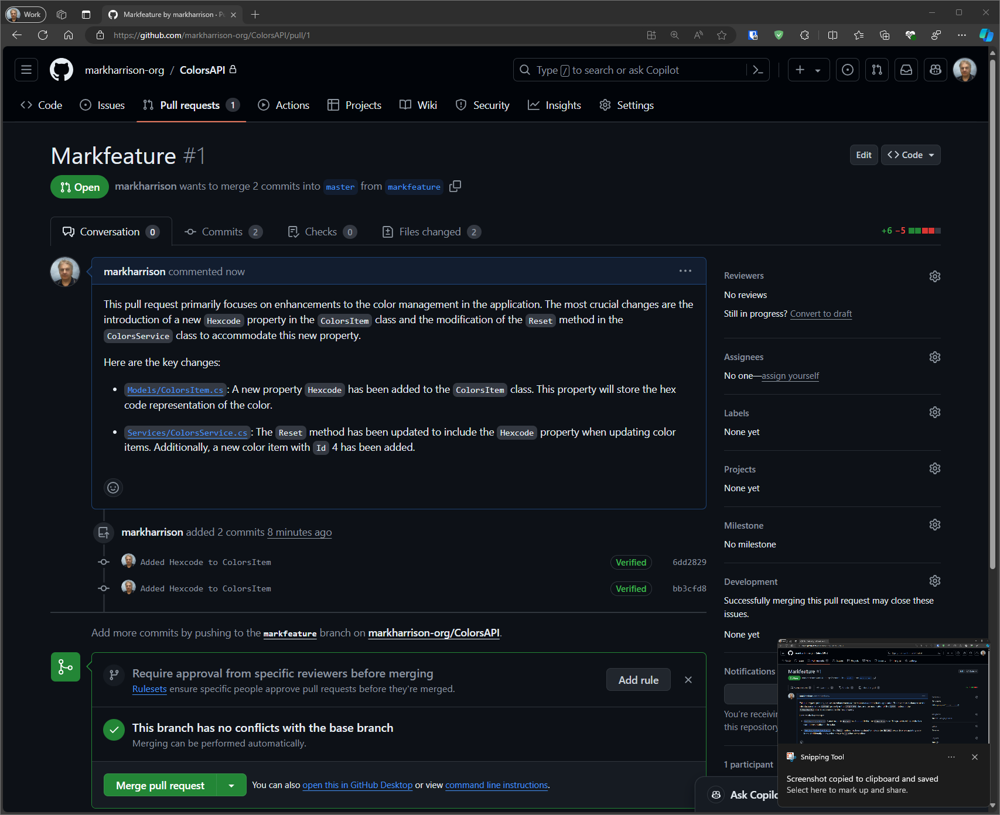

# Pull request summaries

 GitHub Copilot Enterprise allows developers to generate summaries of pull requests based on the code changes. This aims to reduce the time and efforts needed to create informative pull request descriptions, enhancing understanding and accelerating review processes allowing the reviewers to quickly grasp what the changes involve and areas requiring attention.

## Make code changes

- Create a new branch.
- Amend / add some code.
  
## New pull request  

- Go to Pull Requests on menu ... select `New Pull Request`.

- Compare master/main branch with new branch just created ... it will highlight the changes previously made.

## Create pull request  

- select `Create Pull Request`

We can now use GitHub Copilot to help write the summary of changes made in the pull request description

- Select the Copilot Icon - and `Summary` option.

We can see that GitHub Copilot has populated the decription field with a explanation of what changes were made.  The information generated is far more comprehensive than a developer would typically write.

- select `Create Pull Request`

## Ready for approval

The Pull request has now been created and ready for reviewers to check and hopefully approve.

