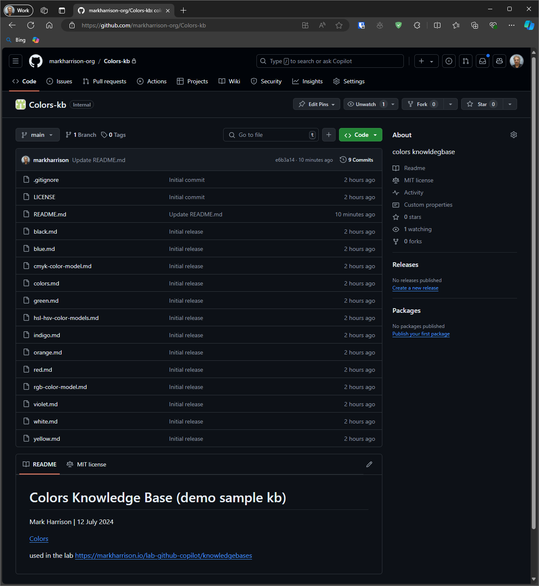
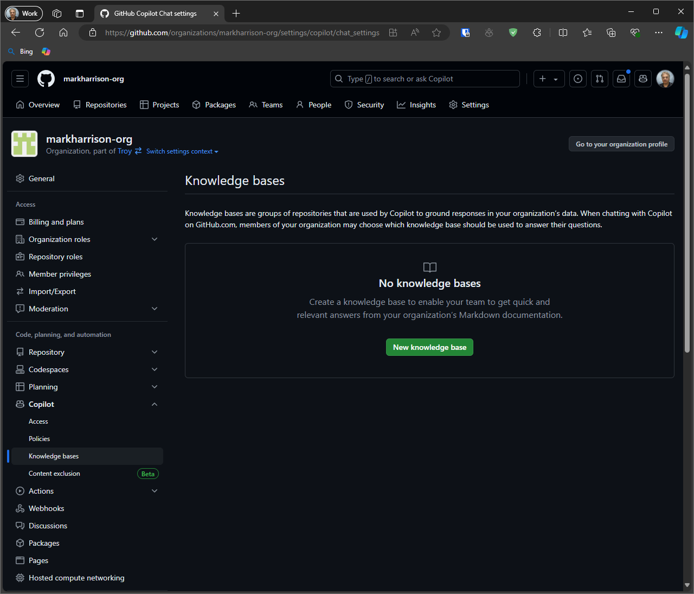
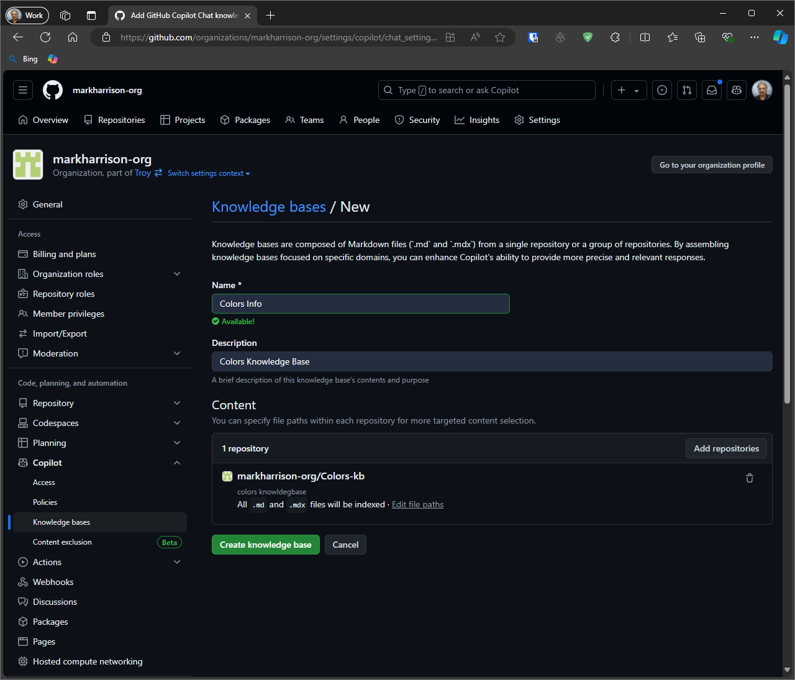
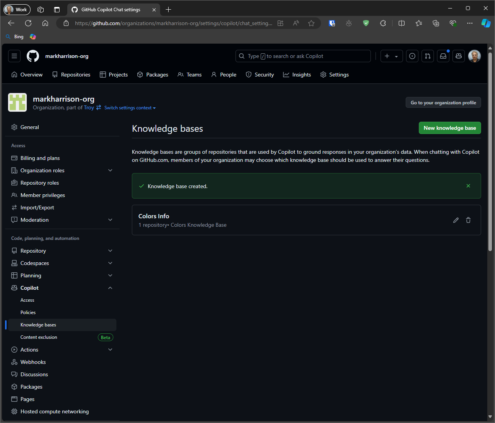
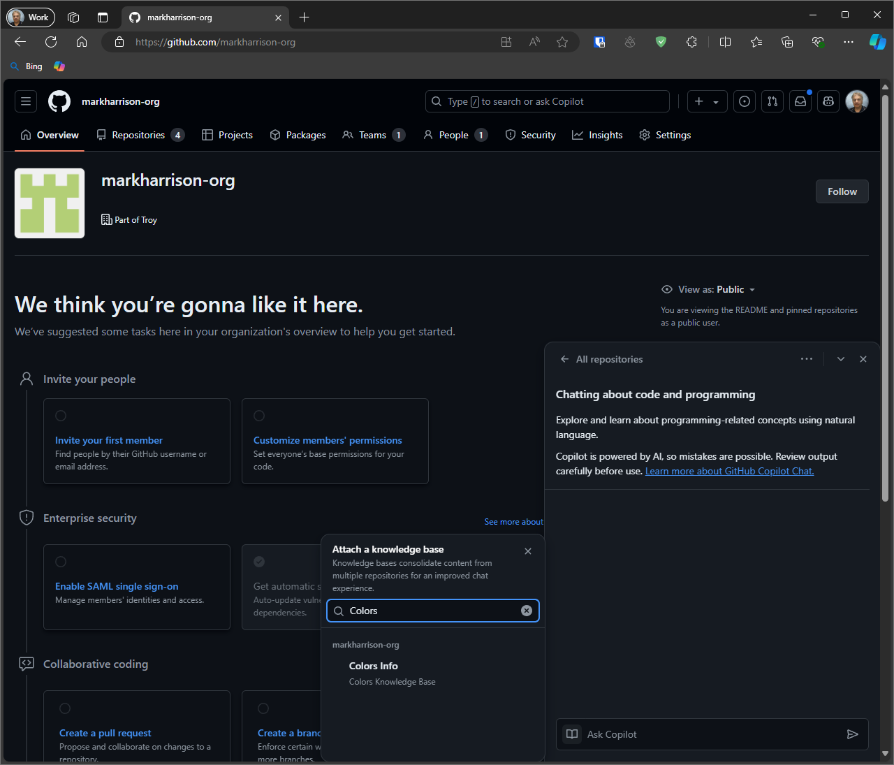
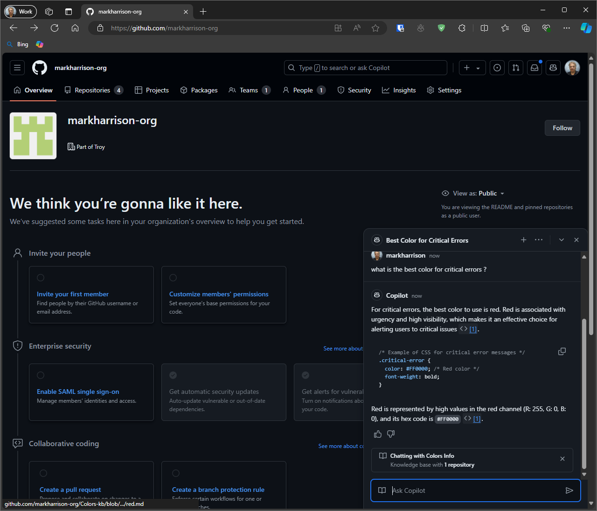
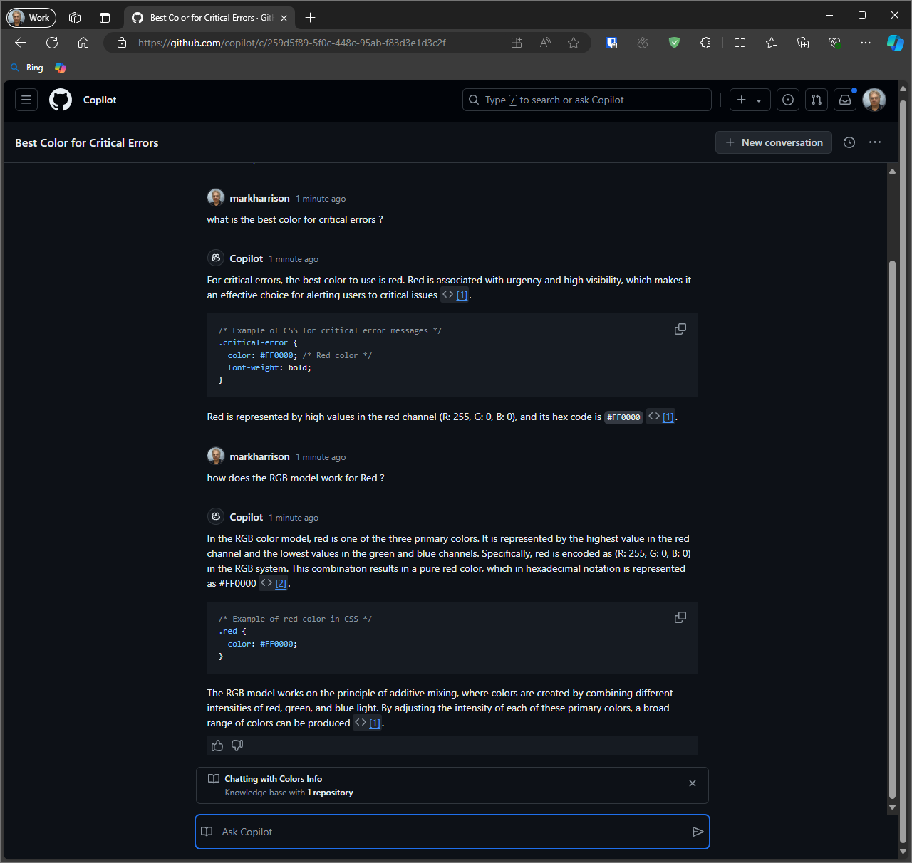
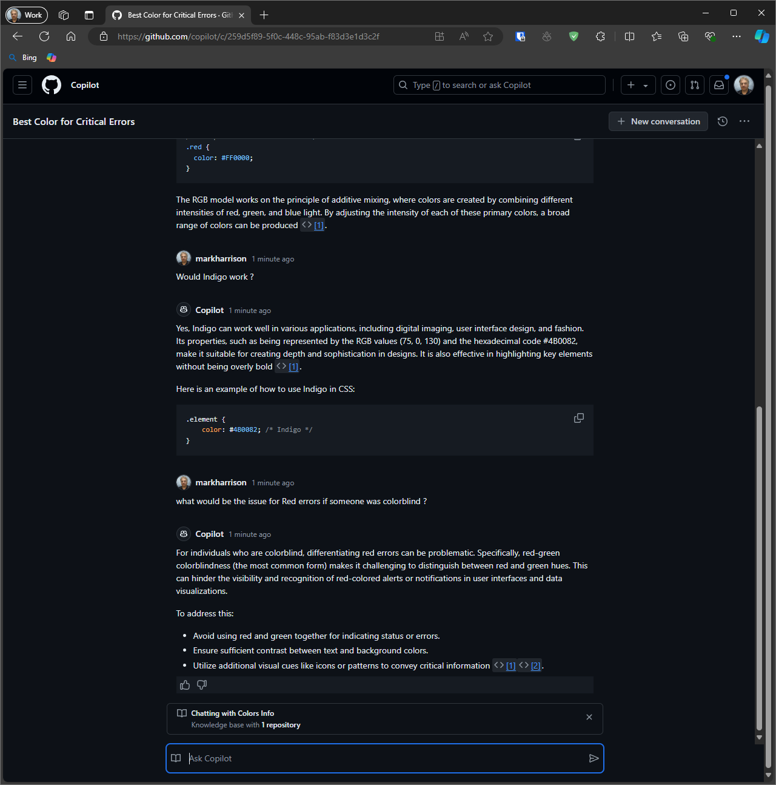
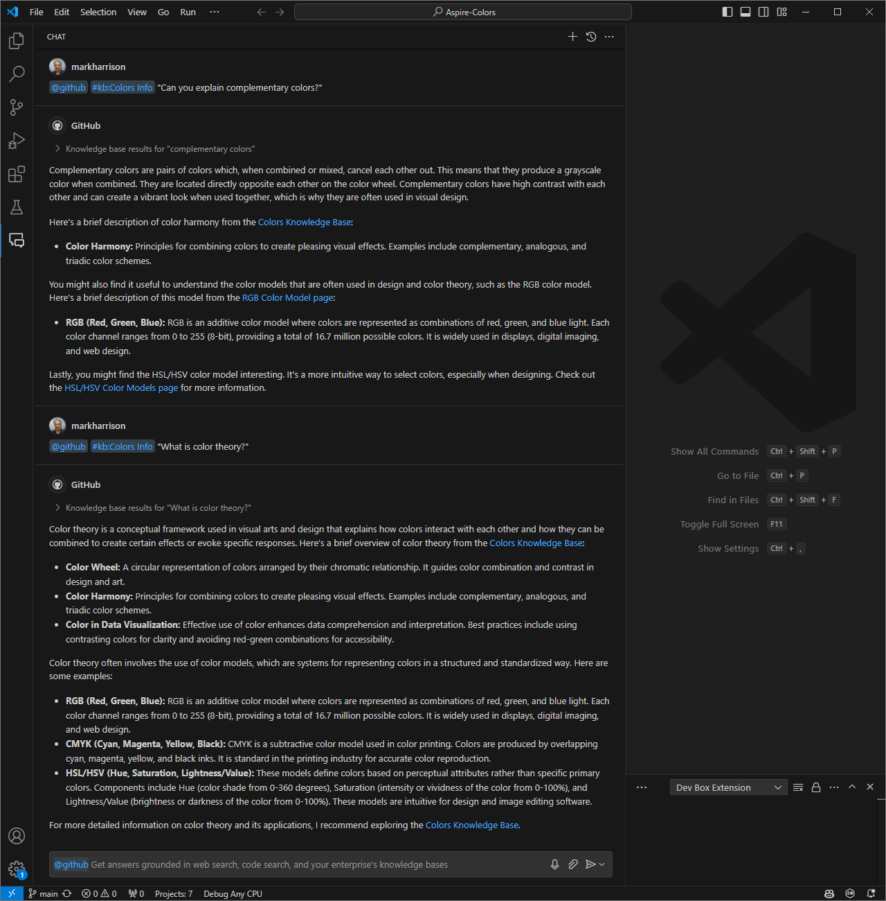

# Knowledge bases

Organization owners can make a knowledge base by gathering markdown documents from multiple repositories. Organization members can then use this knowledge base in GitHub Copilot Chat on github.com or in their IDE to provide context.

## Write / Upload knowledge base  

First we need a knowledge base, that is some markdown files containing information relevant to your business or development processes.

- You can either:

  - Use the provided knowledge base at [https://github.com/markharrison/Colors-kb](<https://github.com/markharrison/Colors-kb>).
  - Alternatively, use (or create) some markdown files with information that interests you, or is relevant to you/your organisation.

- Create a repository in a GitHub Organisation and upload the markdown files.

## Create knowledge base

You can create a knowledge base from a single repository or a selection of repositories.  In our lab - we will just use 1 repository.

- Go to the settings for the GitHub Organisation that contains your repository with the uploaded markdown files.

- In left sidebar menu, select Copilot | Knowledge bases.

- Click button [New Knowledge base].

- Enter Name, Description and select the repository containing markdown files.

- Click button [Create Knowledge base].

The knowledge base is now ready.

## Use knowledge base in github.com

When you ask a question in GitHub Copilot Chat and select a knowledge base, Copilot will search that knowledge base to find and give you an answer.

- Select the Copilot icon (top right).

- Select the book icon on the left of the chat box ... and then select the knowledge base.

- Ask questions.

We can make the chat conversation full screen:

- select the three dots and the option `Take conversation to immersive`.

## Use knowledge base in your IDE

### Visual Studio Code

Visual Studio Code users can now use GitHub Copilot Chat to get answers enriched with context from the Copilot knowledge bases.

- In Copilot Chat type `@github #kb`, then press Enter to open the knowledge base selector.

- Pick an available knowledge base.

- Type your question and press [Enter].

### Visual Studio 2022

Similar functionality is available in Visual Studio 2022 but you need to be running 17.11 Preview 3 or later.  [link](<https://github.blog/changelog/2024-07-09-copilot-knowledge-bases-in-visual-studio-preview/>).
