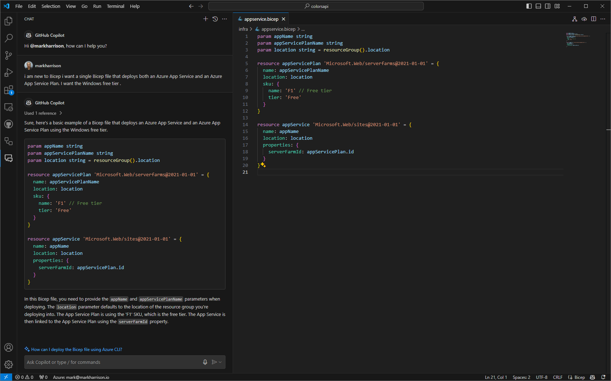
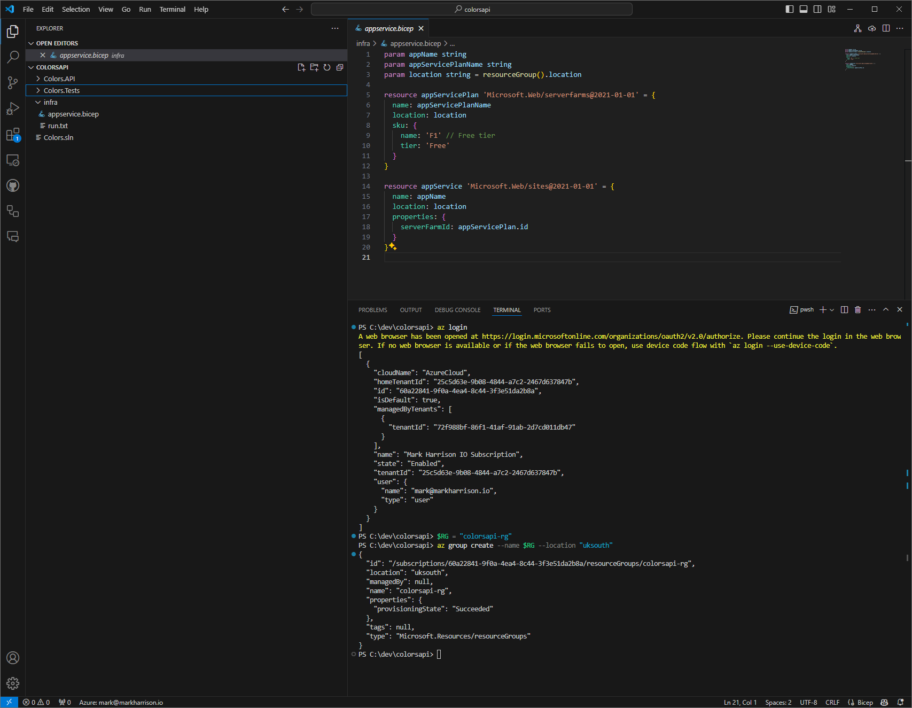
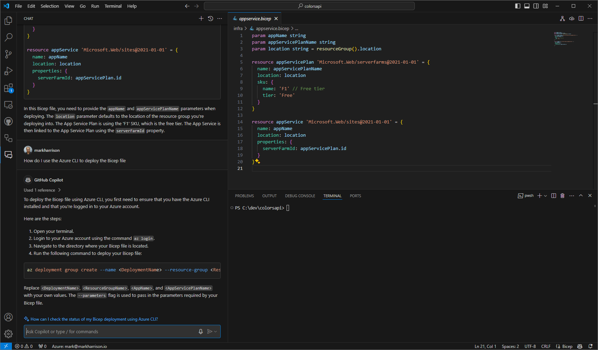
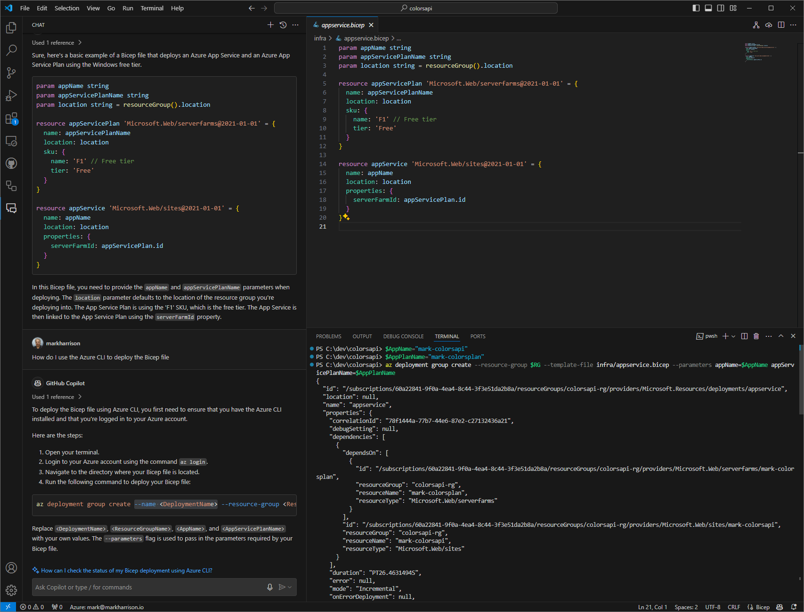
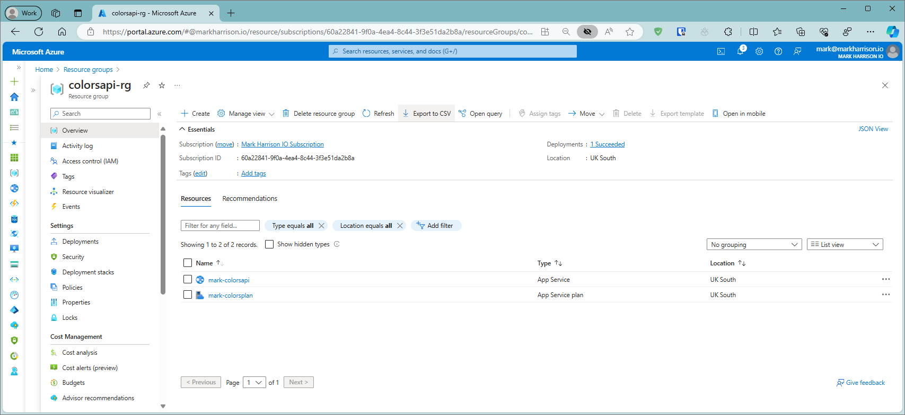
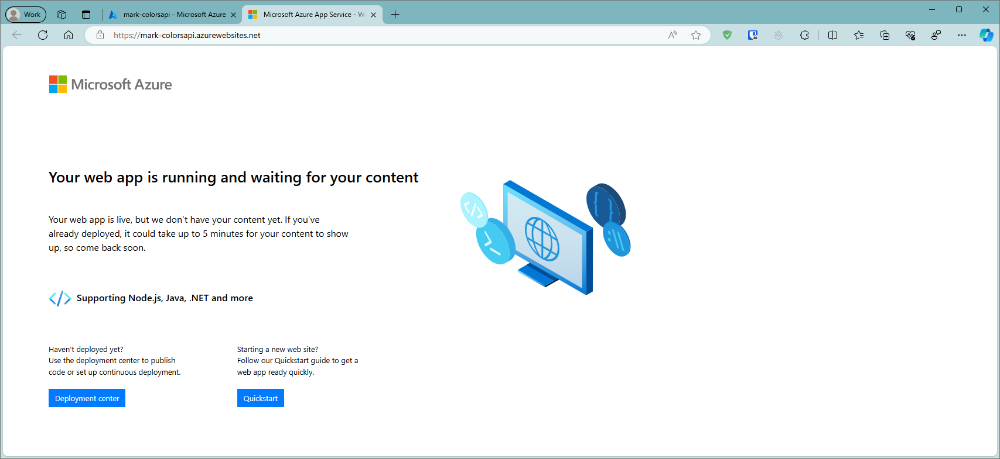

# Infrastructure as Code

Im not an infra person and the 'IaC' Bicep language is new to me. How can I create the infrastructure to run my API?


## Create bicep file

- Create a new folder called `infra` and inside that create a file called `appservice.bicep`

- Ask Copilot Chat the following:

```
I am new to bicep.
I want a single bicep file that deploys both an Azure App Service and an Azure App Service Plan. 
I want the Windows free tier .
```

- Check you are happy with the suggested Bicep content and if so, then copy into `appservice.bicep` and save.



## Deploy bicep file

- Bring up terminal command prompt

- Create an Azure Resource Group

```
az login
$RG = "colorsapi-rg"
az group create --name $RG --location "uksouth"  
```




- Ask Copilot Chat the following:

```
How do I use the Azure CLI to deploy the Bicep file 
```



 
- The response from Copilot Chat explains how to use the Bicep file.  Using this advice to understand the command needed, create the App Service / App Service Plan .


```
$AppName="mark-colorsapi"
$AppPlanName="mark-colorsplan"
az deployment group create --resource-group $RG --template-file infra/appservice.bicep --parameters appName=$AppName appServicePlanName=$AppPlanName
```




We can now see that our infrastructure has been deployed. 






We can now deploy our API App to the App Service. 


 
